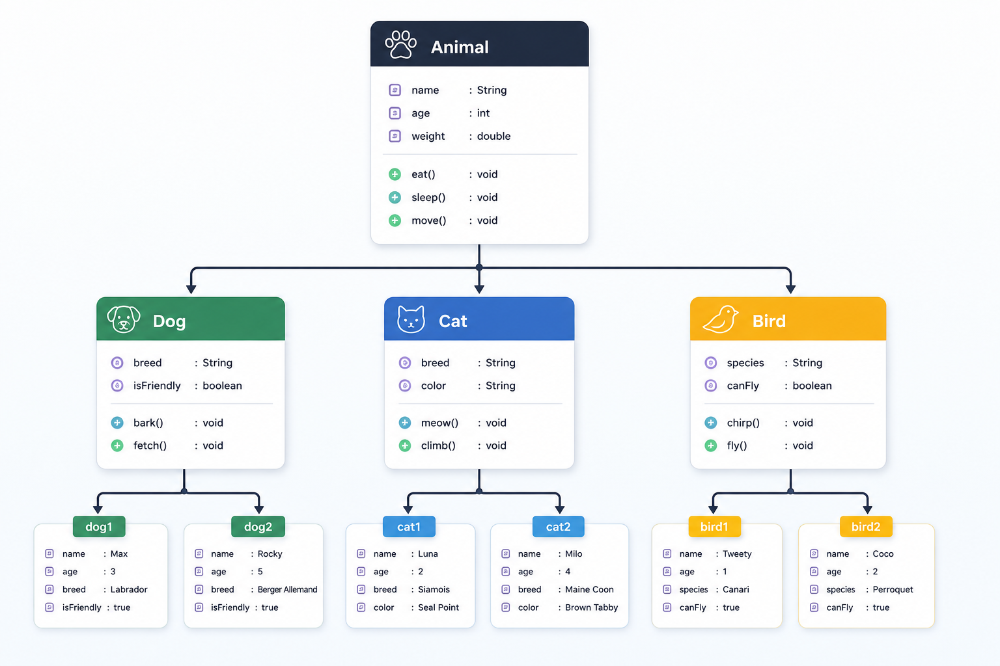
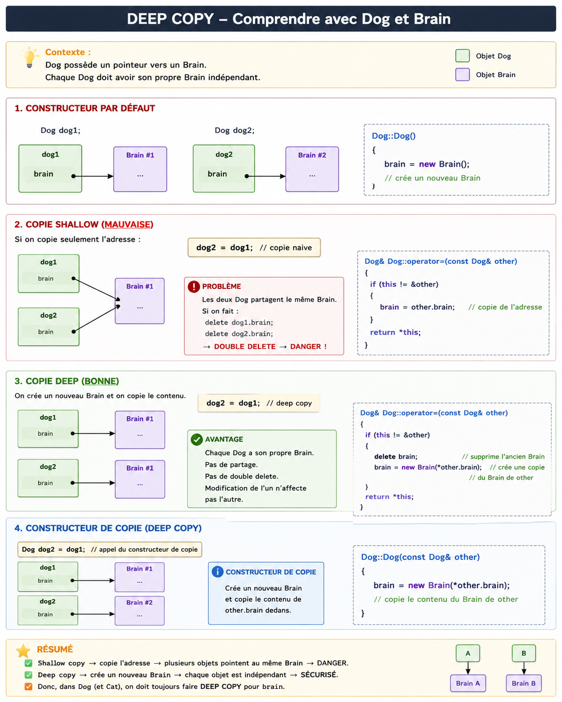

# CPP04 - Guide des notions du module

[](#)
[](#)
[](#)

Ce README sert de fiche de cours progressive pour comprendre CPP04 avant de coder les exercices.

> [!NOTE]
> Objectif du module : comprendre comment manipuler plusieurs objets enfants avec un pointeur parent, tout en gardant le bon comportement grâce au polymorphisme.

## Sommaire

| Section | Notion | Pourquoi c'est important |
|---:|---|---|
| [0](#0-notion-globale--polymorphisme) | Polymorphisme | Vue d'ensemble du module |
| [1](#1-pointeur-vers-classe-de-base) | Pointeur vers classe de base | `Animal*` peut pointer vers `Dog` ou `Cat` |
| [2](#2-méthode-virtuelle) | Méthode virtuelle | Appeler la bonne méthode enfant |
| [3](#3-destructeur-virtuel) | Destructeur virtuel | Détruire correctement les objets enfants |
| [4](#4-classe-abstraite) | Classe abstraite | Empêcher de créer une classe trop générale |
| [5](#5-interface) | Interface | Définir un contrat obligatoire |
| [6](#6-deep-copy--copie-profonde) | Deep copy | Copier correctement les objets avec pointeurs |

---

## 0. Notion globale : polymorphisme

Le mot important de CPP04, c'est :

> [!IMPORTANT]
> **Polymorphisme** = utiliser un pointeur parent pour manipuler plusieurs objets enfants différents, et appeler automatiquement la bonne méthode.

Exemple :

```cpp
Animal* animal1 = new Dog();
Animal* animal2 = new Cat();

animal1->makeSound(); // son du Dog
animal2->makeSound(); // son du Cat
```

Pourquoi ça marche ?

Parce que dans `Animal`, on a une méthode virtuelle :

```cpp
virtual void makeSound() const;
```

Donc C++ regarde le **vrai objet** derrière le pointeur :

```txt
animal1 → vrai objet Dog
animal2 → vrai objet Cat
```

et pas seulement le type du pointeur :

```cpp
Animal*
```

Résumé simple :

```txt
Même type de pointeur : Animal*
Objets réels différents : Dog, Cat, Bird
Même fonction appelée : makeSound()
Résultat différent selon l'objet réel
```

C'est ça le polymorphisme.

Tout CPP04 tourne autour de cette idée :

| Notion | Rôle |
|---|---|
| Pointeur parent | `Animal*` peut pointer vers `Dog` ou `Cat` |
| `virtual` | Appelle la bonne méthode enfant |
| Destructeur `virtual` | Détruit correctement l'objet enfant |
| Classe abstraite | Empêche de créer un `Animal` trop général |
| Interface | Impose un contrat aux classes concrètes |
| Deep copy | Copie correctement les objets avec pointeurs |

Lien avec les exercices :

| Exercice | Ce que tu travailles |
|---|---|
| `ex00` | Polymorphisme avec `Animal`, `Dog`, `Cat` |
| `ex01` | `Brain*`, destructeur virtuel, deep copy |
| `ex02` | `Animal` devient une classe abstraite |
| `ex03` | Interfaces avec `ICharacter` et `IMateriaSource` |

---

## 1. Pointeur vers classe de base

### 1. Classe et objet

Une **classe** est un plan.

```cpp
class Dog
{
};
```

Ici, `Dog` n'est pas encore un chien réel en mémoire. C'est seulement une définition.

Un **objet** est créé à partir de la classe.

```cpp
Dog dog;
```

Là, `dog` existe vraiment en mémoire.

Donc :

```cpp
&dog; // OK : dog est un objet
&Dog; // Erreur : Dog est une classe, pas un objet
```

Phrase à retenir :

```txt
On ne prend pas l'adresse d'une classe.
On prend l'adresse d'un objet créé à partir d'une classe.
```

---

### 2. Héritage

Exemple :

```cpp
class Animal
{
};

class Dog : public Animal
{
};
```

Ici :

```txt
Animal = classe de base / classe parent
Dog    = classe dérivée / classe enfant
```

Schéma :

```txt
Animal
  ↑
 Dog
```



> [!TIP]
> Le schéma montre `Animal` comme classe parent, `Dog`, `Cat`, `Bird` comme classes enfants, puis des objets réels créés à partir de ces classes.

Ça veut dire :

```txt
Dog hérite de Animal.
Dog est un Animal.
```

Un objet `Dog` contient donc deux parties :

```txt
+----------------+
| partie Animal  |
| partie Dog     |
+----------------+
```

---

### 3. Pointeur vers Dog

Si on écrit :

```cpp
Dog dog;
Dog* ptr = &dog;
```

`ptr` est un pointeur de type `Dog*`.

Il pointe vers un vrai objet `Dog`, et comme son type est `Dog*`, il connaît :

```txt
- les fonctions de Dog
- les fonctions héritées de Animal
```

Exemple :

```cpp
class Animal
{
public:
    void sleep()
    {
        std::cout << "Animal sleeps" << std::endl;
    }
};

class Dog : public Animal
{
public:
    void bark()
    {
        std::cout << "Woof" << std::endl;
    }
};
```

Dans le `main` :

```cpp
Dog dog;
Dog* ptr = &dog;

ptr->sleep(); // OK : vient de Animal
ptr->bark();  // OK : vient de Dog
```

Avec un `Dog*`, le compilateur voit tout l'objet `Dog`.

Schéma :

```txt
Dog* ptr
    │
    ▼
+----------------------+  accessible
| partie Animal        |  sleep()
|----------------------|
| partie Dog           |  bark()
+----------------------+
```

---

### 4. Pointeur Animal vers objet Dog

Avec l'héritage, on peut écrire :

```cpp
Dog dog;
Animal* ptr = &dog;
```

Ici :

```txt
ptr est de type Animal*
mais il pointe vers un vrai Dog
```

C'est autorisé parce que :

```txt
Dog hérite de Animal.
Donc un Dog peut être vu comme un Animal.
```

Mais attention : le compilateur regarde le **type du pointeur**.

Donc :

```cpp
ptr->sleep(); // OK
ptr->bark();  // Erreur
```

Pourquoi `ptr->sleep()` marche ?

Parce que `sleep()` existe dans `Animal`.

Pourquoi `ptr->bark()` ne marche pas ?

Parce que `ptr` est déclaré comme `Animal*`, et `Animal` ne possède pas de fonction `bark()`.

Schéma :

```txt
Animal* ptr
      │
      ▼
+----------------------+  accessible avec Animal*
| partie Animal        |  sleep()
|----------------------|
| partie Dog           |  existe, mais pas accessible avec Animal*
+----------------------+
```

Nuance importante :

```txt
Le pointeur pointe bien vers tout l'objet Dog.
Mais comme son type est Animal*, le compilateur autorise seulement
les fonctions déclarées dans Animal.
```

---

### 5. Le rôle de new

`new` ne veut pas dire héritage.

Cette ligne :

```cpp
new Dog();
```

veut dire :

```txt
Créer un vrai objet Dog en mémoire dynamique
et retourner son adresse.
```

Exemple :

```cpp
Dog* d = new Dog();
```

Schéma :

```txt
d
│
▼
+------------+
| objet Dog  |
+------------+
```

Comme l'objet est créé avec `new`, il faut le détruire avec `delete` :

```cpp
delete d;
```

Ces deux lignes ne veulent pas dire la même chose :

```cpp
class Dog : public Animal
```

```txt
Définit l'héritage : Dog est un Animal.
```

```cpp
new Dog()
```

```txt
Crée un objet Dog en mémoire.
```

Donc :

```cpp
Animal* ptr = new Dog();
```

veut dire :

```txt
1. new Dog() crée un vrai Dog.
2. L'adresse de ce Dog est stockée dans un Animal*.
3. C'est accepté parce que Dog hérite de Animal.
```

---

### 6. Tableau de pointeurs

Dans CPP04, on veut souvent manipuler plusieurs animaux différents avec le même type de pointeur.

Exemple :

```cpp
Animal* animals[2];
```

Ça veut dire :

```txt
animals est un tableau de 2 pointeurs vers Animal.
```

Le tableau ne contient pas directement des animaux. Il contient des adresses.

Au début :

```txt
animals[0] -> ?
animals[1] -> ?
```

Puis :

```cpp
animals[0] = new Dog();
animals[1] = new Cat();
```

Schéma :

```txt
animals[0] ───► objet Dog
animals[1] ───► objet Cat
```

C'est possible parce que :

```txt
Dog hérite de Animal.
Cat hérite de Animal.
```

Donc un `Dog*` ou un `Cat*` peut être stocké dans un `Animal*`.

À la fin, comme on a utilisé `new`, il faudra faire :

```cpp
delete animals[0];
delete animals[1];
```

---

### 7. Pourquoi pas Animal animals[2] ?

Cette ligne :

```cpp
Animal animals[2];
```

crée directement deux vrais objets `Animal`.

Schéma :

```txt
animals[0] = objet Animal
animals[1] = objet Animal
```

Mais nous, on veut pouvoir stocker des objets différents :

```txt
Dog
Cat
```

Un `Dog` contient :

```txt
+----------------+
| partie Animal  |
| partie Dog     |
+----------------+
```

Un `Cat` contient :

```txt
+----------------+
| partie Animal  |
| partie Cat     |
+----------------+
```

Un tableau de vrais `Animal` ne peut pas contenir correctement des vrais `Dog` ou des vrais `Cat`.

Donc on utilise :

```cpp
Animal* animals[2];
```

Comme ça, chaque case stocke une adresse, et cette adresse peut pointer vers un enfant différent.

Résumé :

```txt
Animal animals[2]
=> tableau de vrais Animal

Animal* animals[2]
=> tableau d'adresses vers Animal
=> ces adresses peuvent pointer vers Dog ou Cat
```

---

### 8. Exemple complet

```cpp
#include <iostream>

class Animal
{
public:
    void sleep()
    {
        std::cout << "Animal sleeps" << std::endl;
    }
};

class Dog : public Animal
{
public:
    void bark()
    {
        std::cout << "Woof" << std::endl;
    }
};

class Cat : public Animal
{
public:
    void meow()
    {
        std::cout << "Meow" << std::endl;
    }
};

int main()
{
    Dog dog;

    Dog* dogPtr = &dog;
    dogPtr->sleep(); // OK
    dogPtr->bark();  // OK

    Animal* animalPtr = &dog;
    animalPtr->sleep(); // OK
    // animalPtr->bark(); // Erreur : Animal ne connaît pas bark()

    Animal* animals[2];
    animals[0] = new Dog();
    animals[1] = new Cat();

    animals[0]->sleep(); // OK
    animals[1]->sleep(); // OK

    delete animals[0];
    delete animals[1];

    return 0;
}
```

---

### Résumé final

```txt
Classe = plan
Objet = chose créée à partir du plan

Dog hérite de Animal
=> un Dog peut être vu comme un Animal

Dog* ptr = &dog
=> ptr voit la partie Dog + la partie Animal

Animal* ptr = &dog
=> ptr pointe vers un vrai Dog
=> mais il peut appeler seulement les fonctions connues dans Animal

new Dog()
=> crée un objet Dog en mémoire dynamique
=> retourne son adresse

Animal* animals[2]
=> tableau de 2 adresses vers Animal
=> ces adresses peuvent pointer vers Dog ou Cat
```

> [!IMPORTANT]
> Un pointeur vers classe de base permet de stocker l'adresse d'un objet enfant dans un pointeur parent.

La prochaine notion sera : **méthode virtuelle**.

Elle sert à comprendre pourquoi :

```cpp
Animal* ptr = new Dog();
ptr->makeSound();
```

peut appeler la mauvaise fonction si `makeSound()` n'est pas déclarée avec `virtual`.

---

## 2. Méthode virtuelle

Maintenant on passe à la deuxième notion :

```txt
2. Pourquoi on a besoin de virtual
```

---

### 1. Le problème sans virtual

Imagine ce code :

```cpp
class Animal
{
public:
    void makeSound()
    {
        std::cout << "Animal sound" << std::endl;
    }
};

class Dog : public Animal
{
public:
    void makeSound()
    {
        std::cout << "Woof" << std::endl;
    }
};
```

Puis :

```cpp
Animal* ptr = new Dog();

ptr->makeSound();
```

On pourrait penser :

```txt
L'objet réel est Dog.
Donc il va afficher Woof.
```

Mais sans `virtual`, C++ regarde surtout le **type du pointeur** :

```cpp
Animal* ptr
```

Donc il appelle :

```cpp
Animal::makeSound()
```

Résultat :

```txt
Animal sound
```

Pas :

```txt
Woof
```

---

### 2. Pourquoi ?

Parce que `ptr` est de type :

```cpp
Animal*
```

Donc sans `virtual`, C++ dit :

```txt
Je vois un Animal*.
Donc j'appelle la fonction de Animal.
```

Schéma :

```txt
Animal* ptr
     │
     ▼
+----------------+
| Animal part    |  makeSound() appelé
| Dog part       |
+----------------+
```

Même si l'objet réel est un `Dog`, C++ ne descend pas chercher la fonction de `Dog`.

---

### 3. La solution : virtual

Maintenant on ajoute `virtual` dans la classe parent :

```cpp
class Animal
{
public:
    virtual void makeSound()
    {
        std::cout << "Animal sound" << std::endl;
    }
};

class Dog : public Animal
{
public:
    void makeSound()
    {
        std::cout << "Woof" << std::endl;
    }
};
```

Puis :

```cpp
Animal* ptr = new Dog();

ptr->makeSound();
```

Cette fois, C++ dit :

```txt
La fonction makeSound() est virtual.
Je dois regarder le vrai objet derrière le pointeur.
```

Le vrai objet est :

```txt
Dog
```

Donc il appelle :

```cpp
Dog::makeSound()
```

Résultat :

```txt
Woof
```

---

### 4. Résumé simple

```txt
Sans virtual :
C++ regarde le type du pointeur.

Avec virtual :
C++ regarde le vrai type de l'objet.
```

Donc :

```cpp
Animal* ptr = new Dog();
ptr->makeSound();
```

Sans `virtual` :

```txt
Animal::makeSound()
```

Avec `virtual` :

```txt
Dog::makeSound()
```

C'est ça le début du **polymorphisme**.

---

### 5. Redéfinir une méthode

Tu peux voir ça comme ça :

```txt
Animal
 └── method1() affiche "Animal"
```

Puis :

```txt
Dog hérite de Animal.
```

Donc `Dog` possède aussi `method1()`.

Mais dans `Dog`, on veut personnaliser le comportement :

```txt
Dog::method1() affiche "Dog"
```

Donc dans `Animal`, on met :

```cpp
virtual void method1();
```

Ça veut dire :

```txt
Cette méthode peut être redéfinie dans les enfants.
```

Exemple :

```cpp
class Animal
{
public:
    virtual void method1()
    {
        std::cout << "Animal" << std::endl;
    }
};

class Dog : public Animal
{
public:
    void method1()
    {
        std::cout << "Dog" << std::endl;
    }

    void method2()
    {
        std::cout << "Woof" << std::endl;
    }
};
```

Puis :

```cpp
Animal* ptr = new Dog();

ptr->method1();
```

Comme `method1()` est `virtual`, C++ regarde le vrai objet :

```txt
vrai objet = Dog
```

Donc il affiche :

```txt
Dog
```

---

### 6. Ce que virtual ne fait pas

Attention :

```cpp
ptr->method2();
```

ne marche pas.

Pourquoi ?

Parce que `ptr` est de type :

```cpp
Animal*
```

Donc le compilateur regarde la classe `Animal`.

Il demande :

```txt
Est-ce que Animal connaît method2() ?
```

Réponse :

```txt
Non.
```

Donc erreur.

Même si l'objet réel est un `Dog`.

Phrase à retenir :

```txt
virtual permet de choisir la bonne version d'une méthode
qui existe déjà dans la classe parent.

Mais virtual ne permet pas d'appeler une méthode
qui n'existe que dans l'enfant.
```

Donc :

```txt
method1 existe dans Animal + Dog
=> virtual peut choisir Dog::method1()

method2 existe seulement dans Dog
=> Animal* ne peut pas appeler method2()
```

---

### 7. Exemple complet

```cpp
#include <iostream>

class Animal
{
public:
    virtual void makeSound()
    {
        std::cout << "Animal sound" << std::endl;
    }
};

class Dog : public Animal
{
public:
    void makeSound()
    {
        std::cout << "Woof" << std::endl;
    }

    void bark()
    {
        std::cout << "Bark bark" << std::endl;
    }
};

int main()
{
    Animal* ptr = new Dog();

    ptr->makeSound(); // affiche Woof grâce à virtual
    // ptr->bark();   // Erreur : Animal ne connaît pas bark()

    delete ptr;

    return 0;
}
```

---

### Résumé final

```txt
virtual se met dans la classe parent.

Il sert quand on appelle une méthode via un pointeur parent :

Animal* ptr = new Dog();
ptr->makeSound();

Sans virtual :
=> C++ appelle Animal::makeSound()

Avec virtual :
=> C++ regarde le vrai objet
=> il appelle Dog::makeSound()
```

> [!IMPORTANT]
> `virtual` permet au pointeur parent d'appeler la version enfant d'une méthode redéfinie.

La prochaine notion sera : **destructeur virtuel**.

Elle sert à comprendre pourquoi :

```cpp
Animal* ptr = new Dog();
delete ptr;
```

peut mal détruire l'objet si le destructeur de `Animal` n'est pas `virtual`.

---

## 3. Destructeur virtuel

Maintenant on passe à la notion suivante :

```txt
3. Pourquoi le destructeur doit être virtual
```

C'est une notion très importante dans CPP04, surtout avec :

```cpp
Animal* ptr = new Dog();
delete ptr;
```

---

### 1. Rappel : destructeur

Tu connais déjà le destructeur.

```cpp
class Dog
{
public:
    ~Dog()
    {
        std::cout << "Dog destroyed" << std::endl;
    }
};
```

Le destructeur est appelé :

```txt
- quand on fait delete sur un pointeur
- ou quand un objet automatique sort de sa portée
```

Exemple :

```cpp
Dog* dog = new Dog();

delete dog;
```

Ici, `delete dog;` appelle :

```cpp
Dog::~Dog()
```

---

### 2. Exemple avec héritage

Imaginons :

```cpp
class Animal
{
public:
    ~Animal()
    {
        std::cout << "Animal destructor" << std::endl;
    }
};

class Dog : public Animal
{
public:
    ~Dog()
    {
        std::cout << "Dog destructor" << std::endl;
    }
};
```

Puis :

```cpp
Animal* ptr = new Dog();

delete ptr;
```

Question :

```txt
Quel destructeur sera appelé ?
```

On pourrait penser :

```txt
Dog destructor
Animal destructor
```

Parce que le vrai objet est un `Dog`.

Mais sans destructeur `virtual`, ce n'est pas ce qui se passe.

---

### 3. Sans virtual

Sans `virtual`, le compilateur regarde le type du pointeur.

Le pointeur est :

```cpp
Animal*
```

Donc il appelle seulement :

```cpp
Animal::~Animal()
```

Résultat possible :

```txt
Animal destructor
```

Le destructeur de `Dog` n'est pas appelé correctement.

---

### 4. Pourquoi c'est dangereux ?

Dans CPP04 ex01, `Dog` et `Cat` auront un `Brain*`.

Imagine :

```cpp
class Dog : public Animal
{
private:
    Brain* brain;

public:
    Dog()
    {
        brain = new Brain();
    }

    ~Dog()
    {
        delete brain;
    }
};
```

Le `Dog` possède un :

```txt
Brain*
```

Quand on fait :

```cpp
Animal* ptr = new Dog();
delete ptr;
```

si le destructeur de `Dog` n'est pas appelé :

> [!WARNING]
> `brain` n'est jamais supprimé : c'est une fuite mémoire.

Schéma sans `virtual` :

```txt
Animal* ptr
      │
      ▼
+----------------------+
| Animal               |
|----------------------|
| Dog                  |
|  └── Brain*          |
+----------------------+

delete ptr

↓

Animal destructor

↓

Brain reste en mémoire
```

---

### 5. Avec virtual

On écrit le destructeur de la classe parent comme ça :

```cpp
class Animal
{
public:
    virtual ~Animal()
    {
        std::cout << "Animal destructor" << std::endl;
    }
};
```

Maintenant :

```cpp
Animal* ptr = new Dog();

delete ptr;
```

appelle les destructeurs correctement :

```txt
Dog destructor
Animal destructor
```

Dans cet ordre.

Schéma :

```txt
delete ptr

↓

Dog destructor

↓

delete brain

↓

Animal destructor
```

Tout est correctement détruit.

---

### 6. Pourquoi Dog est détruit avant Animal ?

Regarde l'ordre de construction.

Quand tu fais :

```cpp
Dog dog;
```

C++ construit d'abord la partie parent :

```txt
Animal constructor
```

Puis la partie enfant :

```txt
Dog constructor
```

Donc l'ordre de construction est :

```txt
Animal constructor
↓
Dog constructor
```

La destruction se fait dans l'ordre inverse :

```txt
Dog destructor
↓
Animal destructor
```

C'est logique : on démonte d'abord ce qui a été construit en dernier.

---

### 7. Règle d'or

Dès qu'une classe est destinée à être une **classe de base**, son destructeur doit presque toujours être `virtual`.

Dans CPP04, `Animal` est une classe de base.

Donc on doit écrire :

```cpp
class Animal
{
public:
    virtual ~Animal();
};
```

Cette règle est très importante :

```txt
Si tu comptes supprimer des objets enfants avec un pointeur parent,
le destructeur du parent doit être virtual.
```

---

### 8. Exemple complet

```cpp
#include <iostream>

class Animal
{
public:
    Animal()
    {
        std::cout << "Animal constructor" << std::endl;
    }

    virtual ~Animal()
    {
        std::cout << "Animal destructor" << std::endl;
    }
};

class Dog : public Animal
{
public:
    Dog()
    {
        std::cout << "Dog constructor" << std::endl;
    }

    ~Dog()
    {
        std::cout << "Dog destructor" << std::endl;
    }
};

int main()
{
    Animal* ptr = new Dog();

    delete ptr;

    return 0;
}
```

Affichage :

```txt
Animal constructor
Dog constructor
Dog destructor
Animal destructor
```

---

### Résumé final

Sans `virtual` :

```txt
Animal* ptr = new Dog();

delete ptr;

↓

Animal destructor seulement

↓

Memory leak possible
```

Avec `virtual` :

```txt
Animal* ptr = new Dog();

delete ptr;

↓

Dog destructor

↓

Animal destructor

↓

Tout est correctement libéré
```

> [!IMPORTANT]
> Quand on détruit un objet enfant via un pointeur parent, le destructeur du parent doit être `virtual`.

---

### Petit exercice

Dis ce qui sera affiché.

#### Cas 1

```cpp
class Animal
{
public:
    ~Animal()
    {
        std::cout << "Animal\n";
    }
};

class Dog : public Animal
{
public:
    ~Dog()
    {
        std::cout << "Dog\n";
    }
};

Animal* ptr = new Dog();

delete ptr;
```

Que va afficher le programme ?

#### Cas 2

Même code, mais cette fois :

```cpp
virtual ~Animal()
{
    std::cout << "Animal\n";
}
```

Que va afficher le programme ?

Réponse attendue :

```txt
Cas 1 :
Cas 2 :
```

Quand cette notion est claire, on peut passer aux **classes abstraites**, qui sont directement basées sur ce qu'on vient d'apprendre.

---

## 4. Classe abstraite

La suite logique, c'est :

```txt
4. Les classes abstraites
```

On a vu qu'on peut écrire :

```cpp
Animal* animal = new Dog();
```

Mais une question arrive :

```cpp
Animal animal;
```

Est-ce que ça a du sens ?

Pas vraiment.

Dans la vraie vie, tu ne rencontres pas un animal général.

Tu rencontres plutôt :

```txt
Dog
Cat
Bird
```

Donc on veut interdire ça :

```cpp
Animal animal; // interdit
```

Mais autoriser ça :

```cpp
Dog dog; // OK
Cat cat; // OK
```

Pour faire ça, on utilise une **classe abstraite**.

---

### 1. Définition

Une classe abstraite est une classe qu'on ne peut pas instancier directement.

```txt
Instancier = créer un objet à partir d'une classe.
```

Exemple :

```cpp
Animal animal;
```

signifie :

```txt
Créer un vrai objet Animal.
```

Si `Animal` est abstraite, cette ligne est interdite.

---

### 2. Méthode virtuelle pure

Une classe devient abstraite quand elle contient au moins une **méthode virtuelle pure**.

Exemple :

```cpp
class Animal
{
public:
    virtual void makeSound() const = 0;
    virtual ~Animal() {}
};
```

La partie importante est :

```cpp
= 0;
```

Ça veut dire :

```txt
Animal impose cette méthode,
mais Animal ne donne pas son contenu.
```

Donc `Animal` dit aux enfants :

```txt
Chaque enfant doit avoir sa propre version de makeSound().
```

---

### 3. Exemple avec Dog et Cat

```cpp
class Animal
{
public:
    virtual void makeSound() const = 0;
    virtual ~Animal() {}
};

class Dog : public Animal
{
public:
    void makeSound() const
    {
        std::cout << "Woof" << std::endl;
    }
};

class Cat : public Animal
{
public:
    void makeSound() const
    {
        std::cout << "Meow" << std::endl;
    }
};
```

Maintenant :

```cpp
Animal animal; // erreur : Animal est abstraite
Dog dog;       // OK
Cat cat;       // OK
```

Mais on peut encore faire :

```cpp
Animal* animal = new Dog();
animal->makeSound();
delete animal;
```

Résultat :

```txt
Woof
```

Pourquoi c'est autorisé ?

Parce qu'on ne crée pas un vrai `Animal`.

On crée un vrai `Dog`, puis on garde son adresse dans un pointeur `Animal*`.

---

### 4. Classe abstraite et classes enfants

Schéma :

```txt
Animal
 ├── Dog
 ├── Cat
 └── Bird
```

On ne veut pas faire :

```cpp
Animal animal; // pas logique
```

Parce que `Animal` est trop général.

Mais on peut faire :

```cpp
Dog dog1;
Cat cat1;
Bird bird1;
```

Car `Dog`, `Cat` et `Bird` sont des classes concrètes.

Petite correction importante :

```txt
La classe abstraite ne crée pas elle-même les sous-classes.
```

C'est toi qui écris :

```cpp
class Dog : public Animal
{
};
```

Donc :

```txt
Animal ne crée pas Dog.
Dog hérite de Animal.
```

Bonne phrase à retenir :

```txt
Une classe abstraite est une classe parent qu'on ne peut pas instancier directement.
Elle sert de base commune pour les classes enfants.
Les classes enfants peuvent ensuite créer de vrais objets.
```

---

### 5. Classe abstraite et classe concrète

En C++, on peut voir ça comme ça :

```txt
Classe concrète
= on peut créer un objet avec elle

Classe abstraite
= on ne peut pas créer un objet avec elle
```

Exemple de classe concrète :

```cpp
class Dog
{
public:
    void bark()
    {
        std::cout << "Woof" << std::endl;
    }
};
```

On peut faire :

```cpp
Dog dog; // OK
```

Donc `Dog` est une **classe concrète**.

Exemple de classe abstraite :

```cpp
class Animal
{
public:
    virtual void makeSound() = 0;
};
```

On ne peut pas faire :

```cpp
Animal animal; // erreur
```

Mais si `Dog` redéfinit `makeSound()` :

```cpp
class Dog : public Animal
{
public:
    void makeSound()
    {
        std::cout << "Woof" << std::endl;
    }
};
```

Alors :

```cpp
Dog dog; // OK
```

Dans ton niveau actuel, retiens :

```txt
classe normale = classe concrète
```

C'est une classe qu'on peut instancier.

---

### 6. Méthode virtuelle ou virtuelle pure ?

Une **méthode virtuelle** a déjà un comportement dans la classe parent.

```cpp
class Animal
{
public:
    virtual void makeSound()
    {
        std::cout << "Animal sound" << std::endl;
    }
};
```

Donc on peut faire :

```cpp
Animal animal;
animal.makeSound();
```

Résultat :

```txt
Animal sound
```

Et l'enfant peut la personnaliser :

```cpp
class Dog : public Animal
{
public:
    void makeSound()
    {
        std::cout << "Woof" << std::endl;
    }
};
```

Une **méthode virtuelle pure** n'a pas de vrai comportement dans le parent.

```cpp
class Animal
{
public:
    virtual void makeSound() = 0;
};
```

Le `= 0` veut dire :

```txt
Je n'ai pas de version générale.
Chaque enfant doit écrire sa version.
```

Donc :

```cpp
Animal animal; // impossible
```

Mais :

```cpp
Dog dog; // OK si Dog redéfinit makeSound()
```

---

### 7. Attention : l'enfant doit redéfinir

Si une classe enfant ne redéfinit pas toutes les méthodes virtuelles pures, elle reste abstraite.

Exemple :

```cpp
class Animal
{
public:
    virtual void makeSound() = 0;
};

class Dog : public Animal
{
};
```

Ici, `Dog` n'a pas redéfini `makeSound()`.

Donc :

```cpp
Dog dog; // erreur
```

Pourquoi ?

Parce que `Dog` est encore abstraite.

Pour rendre `Dog` concrète, il faut écrire :

```cpp
class Dog : public Animal
{
public:
    void makeSound()
    {
        std::cout << "Woof" << std::endl;
    }
};
```

---

### 8. Exemple complet

```cpp
#include <iostream>

class Animal
{
public:
    Animal()
    {
        std::cout << "Animal constructor" << std::endl;
    }

    virtual ~Animal()
    {
        std::cout << "Animal destructor" << std::endl;
    }

    virtual void makeSound() const = 0;
};

class Dog : public Animal
{
public:
    Dog()
    {
        std::cout << "Dog constructor" << std::endl;
    }

    ~Dog()
    {
        std::cout << "Dog destructor" << std::endl;
    }

    void makeSound() const
    {
        std::cout << "Woof" << std::endl;
    }
};

class Cat : public Animal
{
public:
    void makeSound() const
    {
        std::cout << "Meow" << std::endl;
    }
};

int main()
{
    // Animal animal; // Erreur : Animal est abstraite

    Animal* animal = new Dog();
    animal->makeSound();
    delete animal;

    Cat cat;
    cat.makeSound();

    return 0;
}
```

Affichage possible :

```txt
Animal constructor
Dog constructor
Woof
Dog destructor
Animal destructor
Meow
Animal destructor
```

---

### Résumé final

```txt
Classe abstraite :
- contient au moins une méthode virtuelle pure
- on ne peut pas créer d'objet directement avec elle
- sert de modèle parent

Classe concrète :
- toutes les méthodes obligatoires sont définies
- on peut créer des objets avec elle

Méthode virtuelle :
virtual void makeSound();
=> le parent peut avoir une version
=> l'enfant peut la redéfinir
=> la classe parent peut être instanciée

Méthode virtuelle pure :
virtual void makeSound() = 0;
=> le parent impose la méthode
=> l'enfant doit la redéfinir
=> la classe parent devient abstraite
=> impossible de créer Animal animal
```

> [!IMPORTANT]
> Une classe abstraite est une classe parent qu'on ne peut pas instancier. Elle impose des méthodes que les enfants doivent définir.

Dans CPP04 ex02, le but est justement de rendre `Animal` abstraite :

```cpp
class Animal
{
public:
    virtual ~Animal();
    virtual void makeSound() const = 0;
};
```

La prochaine notion sera : **interface**.

---

## 5. Interface

On passe à la suite :

```txt
5. Les interfaces
```

En C++98, il n'y a pas un vrai mot-clé `interface` comme en Java.

Donc on utilise une **classe abstraite pure**.

---

### 1. C'est quoi une interface ?

Une interface, c'est une classe qui dit :

```txt
Voici les fonctions obligatoires.
Mais je ne donne pas le contenu.
```

Exemple :

```cpp
class IAnimal
{
public:
    virtual void makeSound() = 0;
    virtual void move() = 0;
    virtual ~IAnimal() {}
};
```

Ici, `IAnimal` dit :

```txt
Tout animal doit avoir :
- makeSound()
- move()
```

Mais `IAnimal` ne dit pas comment faire.

C'est aux classes enfants de donner le vrai comportement.

---

### 2. Les enfants remplissent le contrat

Exemple avec `Dog` :

```cpp
class Dog : public IAnimal
{
public:
    void makeSound()
    {
        std::cout << "Woof" << std::endl;
    }

    void move()
    {
        std::cout << "Dog runs" << std::endl;
    }
};
```

Exemple avec `Bird` :

```cpp
class Bird : public IAnimal
{
public:
    void makeSound()
    {
        std::cout << "Chirp" << std::endl;
    }

    void move()
    {
        std::cout << "Bird flies" << std::endl;
    }
};
```

`Dog` et `Bird` respectent le contrat parce qu'ils définissent :

```txt
makeSound()
move()
```

Si une classe oublie une de ces méthodes, elle reste abstraite.

---

### 3. Pourquoi c'est utile ?

Parce qu'on peut écrire du code qui dépend du contrat, pas de la classe exacte.

Exemple :

```cpp
IAnimal* animal = new Dog();
animal->makeSound();
animal->move();
delete animal;
```

Ou :

```cpp
IAnimal* animal = new Bird();
animal->makeSound();
animal->move();
delete animal;
```

Le même code fonctionne avec plusieurs classes différentes.

Ce qui compte, c'est que chaque classe respecte l'interface `IAnimal`.

---

### 4. Classe abstraite ou interface ?

Une **classe abstraite** :

```txt
- a au moins une méthode virtuelle pure = 0
- ne peut pas être instanciée
- peut avoir des attributs
- peut avoir des méthodes normales
- peut avoir un constructeur
```

Exemple :

```cpp
class Animal
{
protected:
    std::string type;

public:
    virtual void makeSound() = 0;
    void sleep();
    virtual ~Animal() {}
};
```

Donc :

```cpp
Animal a; // impossible
```

Mais `Animal` peut quand même contenir :

```txt
- un attribut type
- une méthode normale sleep()
- une méthode virtuelle pure makeSound()
```

---

### 5. Interface en C++98

En C++98, une interface est généralement une classe abstraite qui contient presque uniquement :

```txt
- des méthodes virtuelles pures
- un destructeur virtuel
- pas d'attributs importants
- pas de vrai comportement
```

Exemple inspiré de CPP04 ex03 :

```cpp
class ICharacter
{
public:
    virtual ~ICharacter() {}
    virtual std::string const & getName() const = 0;
    virtual void equip(AMateria* m) = 0;
    virtual void unequip(int idx) = 0;
    virtual void use(int idx, ICharacter& target) = 0;
};
```

Cette interface dit :

```txt
Une classe qui veut être un ICharacter doit avoir :
- getName()
- equip()
- unequip()
- use()
```

Mais `ICharacter` ne dit pas comment stocker l'inventaire.

C'est la classe concrète `Character` qui fera le vrai travail.

---

### 6. Est-ce qu'une interface est une classe abstraite ?

Oui.

```txt
Toute interface est une classe abstraite.
```

Mais :

```txt
Toute classe abstraite n'est pas forcément une interface.
```

Pourquoi ?

Parce qu'une classe abstraite peut avoir :

```txt
- des attributs
- des méthodes normales
- une partie de comportement déjà écrite
```

Une interface sert surtout de **contrat**.

---

### 7. Est-ce qu'une interface peut être instanciée ?

Non.

```cpp
ICharacter c; // impossible
```

Mais on peut faire :

```cpp
ICharacter* c = new Character("me");
```

Pourquoi ?

Parce qu'on ne crée pas une interface.

On crée un vrai `Character`, puis on garde son adresse dans un pointeur `ICharacter*`.

Exactement comme :

```cpp
Animal* a = new Dog();
```

---

### 8. Dans CPP04 ex03

Dans l'exercice 03, tu as deux interfaces principales :

```txt
ICharacter
IMateriaSource
```

`ICharacter` impose :

```cpp
virtual std::string const & getName() const = 0;
virtual void equip(AMateria* m) = 0;
virtual void unequip(int idx) = 0;
virtual void use(int idx, ICharacter& target) = 0;
```

La classe concrète sera :

```txt
Character
```

`IMateriaSource` impose :

```cpp
virtual void learnMateria(AMateria*) = 0;
virtual AMateria* createMateria(std::string const & type) = 0;
```

La classe concrète sera :

```txt
MateriaSource
```

Donc le sujet demande :

```txt
Interface        Classe concrète
ICharacter    →  Character
IMateriaSource → MateriaSource
```

---

### 9. Exemple complet

```cpp
#include <iostream>

class IAnimal
{
public:
    virtual ~IAnimal() {}
    virtual void makeSound() = 0;
    virtual void move() = 0;
};

class Dog : public IAnimal
{
public:
    void makeSound()
    {
        std::cout << "Woof" << std::endl;
    }

    void move()
    {
        std::cout << "Dog runs" << std::endl;
    }
};

class Bird : public IAnimal
{
public:
    void makeSound()
    {
        std::cout << "Chirp" << std::endl;
    }

    void move()
    {
        std::cout << "Bird flies" << std::endl;
    }
};

int main()
{
    IAnimal* animal1 = new Dog();
    IAnimal* animal2 = new Bird();

    animal1->makeSound();
    animal1->move();

    animal2->makeSound();
    animal2->move();

    delete animal1;
    delete animal2;

    return 0;
}
```

Affichage :

```txt
Woof
Dog runs
Chirp
Bird flies
```

---

### Résumé final

```txt
Classe abstraite :
= parent incomplet
= peut avoir attributs, méthodes normales, méthodes virtuelles pures

Interface :
= contrat pur
= contient surtout des méthodes virtuelles pures
= dit ce qu'une classe doit savoir faire
= ne dit pas comment le faire

Toute interface est une classe abstraite.
Mais toute classe abstraite n'est pas forcément une interface.
```

> [!IMPORTANT]
> Une interface est un contrat : si une classe hérite de l'interface, elle doit implémenter toutes les méthodes demandées.

Dans CPP04 ex03 :

```txt
ICharacter est le contrat.
Character est la vraie classe qui respecte ce contrat.

IMateriaSource est le contrat.
MateriaSource est la vraie classe qui respecte ce contrat.
```

La prochaine notion sera : **deep copy / copie profonde**.

---

## 6. Deep copy / copie profonde

On passe à la dernière grosse notion du CPP04 :

```txt
6. Deep copy / copie profonde
```

Cette notion devient très importante dans CPP04 ex01, parce que `Dog` et `Cat` auront un pointeur vers un `Brain`.



> [!TIP]
> Cette image résume le problème : une shallow copy partage le même `Brain`, alors qu'une deep copy crée un nouveau `Brain` indépendant.

---

### 1. Le problème

Imagine une classe `Dog` qui possède un pointeur :

```cpp
class Dog
{
private:
    Brain* brain;
};
```

Et dans le constructeur :

```cpp
Dog::Dog()
{
    brain = new Brain();
}
```

Donc chaque chien a un cerveau créé avec `new`.

Schéma :

```txt
Dog A
 |
 v
Brain A
```

Le pointeur `brain` contient l'adresse d'un objet `Brain` créé en mémoire dynamique.

---

### 2. Mauvaise copie : shallow copy

Une **shallow copy** veut dire :

```txt
copie superficielle
```

C'est une copie qui copie seulement l'adresse.

Exemple dangereux :

```cpp
dog2.brain = dog1.brain;
```

Schéma :

```txt
Dog 1 ----\
           \
            Brain
           /
Dog 2 ----/
```

Les deux chiens partagent le même `Brain`.

Le problème arrive à la destruction :

```cpp
delete dog1.brain;
delete dog2.brain;
```

On risque de supprimer deux fois la même mémoire.

> [!WARNING]
> Résultat possible : `double free`, crash, ou comportement indéfini.

Et même avant la destruction, il y a un autre problème :

```txt
Si Dog 1 modifie son Brain,
Dog 2 voit aussi la modification,
car ils partagent le même Brain.
```

Ce n'est pas ce qu'on veut.

---

### 3. Bonne copie : deep copy

Une **deep copy** veut dire :

```txt
copie profonde
```

L'idée :

```txt
Je ne copie pas seulement l'adresse.
Je crée un nouveau Brain.
Puis je copie le contenu dedans.
```

Schéma :

```txt
Dog 1
 |
 v
Brain 1

Dog 2
 |
 v
Brain 2
```

Chaque `Dog` a son propre `Brain`.

Donc :

```txt
Dog 1 peut modifier Brain 1.
Dog 2 garde son Brain 2.
```

Et à la destruction :

```txt
Dog 1 delete Brain 1.
Dog 2 delete Brain 2.
```

Pas de double suppression.

---

### 4. Constructeur de copie

Le constructeur de copie sert à créer un nouvel objet à partir d'un objet existant.

Exemple :

```cpp
Dog dog1;
Dog dog2(dog1);
```

ou :

```cpp
Dog dog2 = dog1;
```

Pour faire une deep copy :

```cpp
Dog::Dog(const Dog& other)
{
    brain = new Brain(*other.brain);
}
```

Cette ligne :

```cpp
brain = new Brain(*other.brain);
```

veut dire :

```txt
1. Créer un nouveau Brain.
2. Copier dedans le contenu du Brain de other.
3. Stocker l'adresse de ce nouveau Brain dans this->brain.
```

Donc on ne partage pas le même pointeur.

---

### 5. Opérateur d'affectation

L'opérateur d'affectation sert quand les deux objets existent déjà.

Exemple :

```cpp
Dog dog1;
Dog dog2;

dog2 = dog1;
```

Ici, `dog2` avait déjà son propre `Brain`.

Donc avant de lui donner une nouvelle copie, il faut libérer l'ancien `Brain`.

```cpp
Dog& Dog::operator=(const Dog& other)
{
    if (this != &other)
    {
        delete brain;
        brain = new Brain(*other.brain);
    }
    return *this;
}
```

Pourquoi :

```cpp
if (this != &other)
```

Parce qu'on veut éviter l'auto-affectation :

```cpp
dog1 = dog1;
```

Sans cette protection, on pourrait supprimer le `brain`, puis essayer de le recopier depuis lui-même.

---

### 6. Destructeur

Comme `Dog` crée un `Brain` avec `new`, il doit le supprimer dans son destructeur.

```cpp
Dog::~Dog()
{
    delete brain;
}
```

Règle simple :

```txt
Si ta classe fait new,
elle doit faire delete.
```

Dans CPP04, comme on supprime souvent un `Dog` avec un pointeur `Animal*`, il faut aussi que le destructeur de `Animal` soit `virtual`.

---

### 7. Forme canonique orthodoxe

Dans les modules C++ de 42, à partir du CPP02, les classes doivent souvent respecter la forme canonique orthodoxe.

Pour `Dog`, ça veut dire :

```cpp
class Dog
{
public:
    Dog();
    Dog(const Dog& other);
    Dog& operator=(const Dog& other);
    ~Dog();
};
```

Dans CPP04 ex01, c'est très important parce que `Dog` et `Cat` possèdent un `Brain*`.

Donc ils doivent gérer :

```txt
- constructeur
- constructeur de copie
- opérateur =
- destructeur
```

---

### 8. Exemple complet

```cpp
class Brain
{
public:
    std::string ideas[100];
};

class Dog
{
private:
    Brain* brain;

public:
    Dog()
    {
        brain = new Brain();
    }

    Dog(const Dog& other)
    {
        brain = new Brain(*other.brain);
    }

    Dog& operator=(const Dog& other)
    {
        if (this != &other)
        {
            delete brain;
            brain = new Brain(*other.brain);
        }
        return *this;
    }

    ~Dog()
    {
        delete brain;
    }
};
```

---

### 9. Comment tester une deep copy ?

L'idée du test :

```txt
1. Créer un Dog A.
2. Modifier une idée dans son Brain.
3. Copier Dog A dans Dog B.
4. Modifier le Brain de Dog B.
5. Vérifier que le Brain de Dog A n'a pas changé.
```

En pratique, il faut souvent ajouter des getters/setters pour tester proprement :

```cpp
void Dog::setIdea(int index, std::string const & idea);
std::string Dog::getIdea(int index) const;
```

Exemple logique :

```cpp
Dog dog1;
dog1.setIdea(0, "I like bones");

Dog dog2(dog1);
dog2.setIdea(0, "I like sleep");

std::cout << dog1.getIdea(0) << std::endl;
std::cout << dog2.getIdea(0) << std::endl;
```

Si la copie est profonde, tu dois obtenir deux idées différentes :

```txt
I like bones
I like sleep
```

Si la copie est superficielle, les deux chiens risquent de partager le même `Brain`.

---

### Résumé final

```txt
Shallow copy :
= copie seulement l'adresse
= deux objets partagent la même mémoire
= dangereux avec des pointeurs
= risque de double delete

Deep copy :
= crée une nouvelle mémoire
= copie le contenu dedans
= chaque objet possède sa propre ressource
= destruction propre
```

Dans CPP04 ex01 :

```txt
Dog et Cat ont un Brain*
donc Dog et Cat doivent faire une deep copy.
```

> [!IMPORTANT]
> Quand une classe possède un pointeur vers une ressource créée avec `new`, sa copie doit généralement créer une nouvelle ressource, pas seulement copier l'adresse.

Et avec CPP04, retiens le trio :

```txt
new dans le constructeur
delete dans le destructeur
new copie dans le constructeur de copie et operator=
```

---

## Mémo rapide CPP04

| Notion | Syntaxe clé | À retenir |
|---|---|---|
| Pointeur parent | `Animal* a = new Dog();` | Le pointeur est `Animal*`, mais l'objet réel est `Dog` |
| Méthode virtuelle | `virtual void makeSound();` | Permet d'appeler la version enfant |
| Destructeur virtuel | `virtual ~Animal();` | Obligatoire pour `delete` via un pointeur parent |
| Classe abstraite | `virtual void f() = 0;` | Impossible de créer directement cette classe |
| Interface | `class ICharacter` avec méthodes `= 0` | Contrat que la classe concrète doit respecter |
| Deep copy | `new Brain(*other.brain)` | Crée une nouvelle ressource au lieu de copier l'adresse |

> [!NOTE]
> Si tu comprends ce tableau, tu as la carte mentale principale de CPP04. Les exercices servent ensuite à pratiquer ces idées en code.
